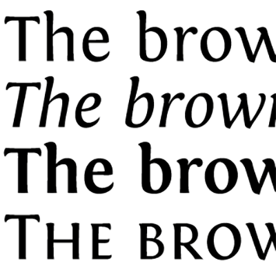

[![Latest][Badge-Latest]][Latest]
[![Build][SVG-Build]][Build]
[![Twitter][SVG-Twitter]][Twitter]
[![Sponsor][SVG-Sponsor]][Sponsor]
[![PayPal][SVG-PayPal]][PayPal]

<strong>Contents</strong>

- [About](#About "Go to About")
- [Requirements](#Requirements "Go to Requirements")
- [Installation](#Installation "Go to Installation")
- [Feedback](#Feedback "Go to Feedback")
- [Links](#Links "Go to Links")

## [About][Top]

**SharedMedia_Fontin** inserts additional fonts from [exljbris Font Foundry][exljbris] into SharedMediaLib's storage, including:

- Delicious
- Diavlo
- Fontin (as seen in [Path of Exile](https://www.pathofexile.com/forum/view-thread/52060)!)
- Fontin Sans (I recommend this one for Combat Text and maybe Unit Names)

These fonts are available on a separate [license](https://www.exljbris.com/eula.html).

## [Requirements][Top]

This add-on adds fonts into SharedMediaLib, which will add it as a font selection in any addon that supports it, such as most UI addons. I use it with ElvUI.

Keep in mind that simply **installing the addon without choosing the font anywhere will have no effect**.

## [Installation][Top]

Install the package through your preferred add-on manager or extract the archive to your add-ons directory.

- **Classic:** `World of Warcraft\_classic_\Interface\AddOns`
- **Retail:** `World of Warcraft\_retail_\Interface\AddOns`

## [Feedback][Top]

For bug reports and suggestions, use the [issue tracker].

## [Links][Top]

- [CurseForge][CurseForge]
- [exljbris Font Foundry][exljbris]

[Links]: #

[Latest]: https://github.com/dlecina/SharedMedia_Fontin/releases (Latest Release)
[Build]: https://github.com/dlecina/SharedMedia_Fontin/actions?query=workflow%3ARelease (Build Status)
[Twitter]: https://twitter.com/alllucky7s (Follow on Twitter)
[Sponsor]: https://github.com/sponsors/dlecina (Sponsor on GitHub)
[PayPal]: https://www.paypal.me/dlecina (Donate via PayPal)

[World of Warcraft]: https://worldofwarcraft.com (World of Warcraft)

[Issue Tracker]: https://github.com/dlecina/SharedMedia_Fontin/issues (Report an Issue)

[CurseForge]: https://www.curseforge.com/wow/addons/sharedmedia_fontin (View on CurseForge)
[GitHub]: https://github.com/dlecina/SharedMedia_Fontin (View on GitHub)

[exljbris]: https://www.exljbris.com/ (exljbris Font Foundry)

[Top]: #Top (Top of the Page)

[Images]: #

[Badge-Latest]: https://img.shields.io/github/v/release/dlecina/SharedMedia_Fontin?include_prereleases&label=Latest&style=flat-square
[SVG-Build]: https://img.shields.io/github/workflow/status/dlecina/SharedMedia_Fontin/Release?label=Build&logo=github&logoColor=fff&style=flat-square
[SVG-Twitter]: https://img.shields.io/badge/Twitter-1DA1F2?logo=twitter&logoColor=fff&style=flat-square
[SVG-Sponsor]: https://img.shields.io/badge/Sponsor-555?logo=github&logoColor=fff&style=flat-square
[SVG-PayPal]: https://img.shields.io/endpoint?url=https://www.stormfx.com/img/svg/paypal.json
